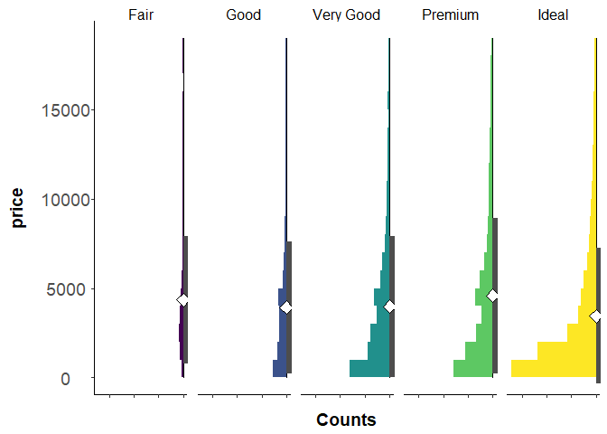

<!-- README.md is generated from README.Rmd. Please edit that file -->

# seastackplot

<!-- badges: start -->
<!-- badges: end -->

The goal of seastackplot is to create graphs that accurately represent
the distribution and summary statistics of data.

## Installation

You can install the development version of seastackplot from
[GitHub](https://github.com/) with:

``` r
# install.packages("remotes")
remotes::install_github("Al-Stu/seastackplot")
```

## Creating a sea stack plot

The easiest way to plot a sea stack plot is using the `sea_stack_plot()`
function. As an example, we will create a graph of how price differs
between different diamond cuts using the ‘diamonds’ data set from the
`ggplot2` package. To create a sea stack plot using the
`sea_stack_plot()`, you need to make sure your data is long format (see
here for an explanation of long vs wide format data
<http://www.cookbook-r.com/Manipulating_data/Converting_data_between_wide_and_long_format/>).

To plot a default sea stack plot with mean and standard deviation, the
`sea_stack_plot()` function required the following variables: \* `data`
your long format data frame or tibble \* `data.column` the name of the
column your values are in \* `group.column` the name of the column your
group names are in

``` r
library(seastackplot)
#> Loading required package: ggplot2

sea_stack_plot(data = ggplot2::diamonds,
               data.column = 'price',
               group.column = 'cut',
               bin.width = 1000 # bin.width defaults to 1, for this data that is
                                # too high resolution so we set it to 1000
               )
```



The `sea_stack_plot()` function also includes the following variables
for plot customisation: \* `data.label` the desired title for the data
axis, if left NULL (default), will be the value of data.column

- `bin.width` the bin width being used to plot

- `mean.size` the size of the diamond showing the mean

- `median.size` the size of the point showing the median

- `orientation` “vertical” or “horizontal”, whether or not the plot is
  being plotted vertically (default) or horizontally

- `show.mean` whether the mean should be plotted

- `show.median` whether the median should be plotted

- `show.standard.dev` whether the standard deviation rectangle should be
  plotted

- `show.confidence.int` whether the confidence interval should be
  plotted

``` r
sea_stack_plot(data = ggplot2::diamonds,
               data.column = 'z',
               group.column = 'cut',
               data.label = 'Depth',
               show.mean = T, 
               show.median = T, 
               show.standard.dev = F, 
               show.confidence.int = T
               )
```


<!-- You'll still need to render `README.Rmd` regularly, to keep `README.md` up-to-date. `devtools::build_readme()` is handy for this. -->
<!-- You can also embed plots, for example: -->
<!-- ```{r pressure, echo = FALSE} -->
<!-- plot(pressure) -->
<!-- ``` -->
<!-- In that case, don't forget to commit and push the resulting figure files, so they display on GitHub and CRAN. -->
